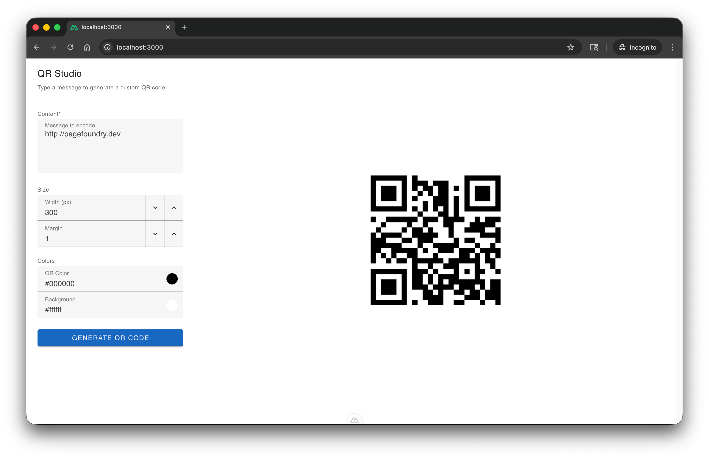

# QR Studio

Run QR Studio locally to generate custom QR codes with full control over your data. Built with Nuxt 3 and Vuetify.



## Features

- **Message Encoding**: Encode messages up to 2000 characters long
- **Customizable Size**: Adjust QR code width up to 1000px
- **Margin Control**: Set custom margins around the QR code
- **Color Customization**: Choose light and dark colors for the QR code
- **Server-Side Generation**: All QR code generation is handled server-side using the qrcode library—your data is processed securely on the server

## Prerequisites

- Node.js (v18 or later)
- pnpm

## Installation

Clone the repository and install dependencies:

```bash
git clone https://github.com/storbeck/qrstudio.git
cd qrstudio
pnpm install
```

## Development

Start the development server:

```bash
pnpm dev
```

Open [http://localhost:3000](http://localhost:3000) in your browser.

## Production

Build for production:

```bash
pnpm build
```

Preview the production build:

```bash
pnpm preview
```
